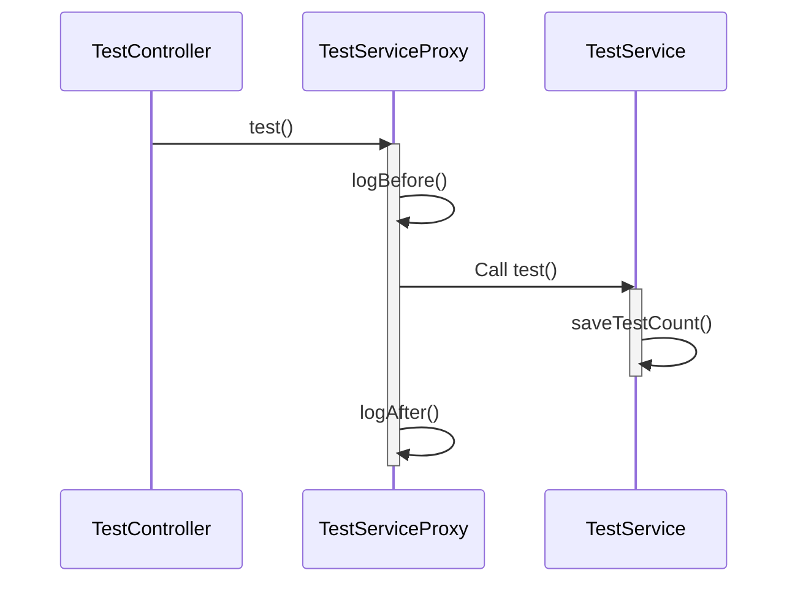

## Spring AOP 이해하기

### 참고한 블로그들
[Kotlin으로 Spring AOP 극복하기!](https://tech.kakaopay.com/post/overcome-spring-aop-with-kotlin/)  

[Incheol's TECH BLOG](https://incheol-jung.gitbook.io/docs/study/tobys-spring/undefined/6-aop)

### 들어가기 앞서
아래 글은 AOP라는 개념에 대한 설명은 없다. Aspect-Oriented Programming 기법에서 쓰이는 주요 개념과 그것을 구현한 Spring AOP 예시코드, Spring AOP의 한계점에 대해서 다룬다.


### Advice
애플리케이션의 특정 지점에 실행될 로직을 의미한다.
아래 예시코드를 살펴보자

```java
@Before("execution(* com.example.service.*.*(..))")
public void logBefore(JoinPoint joinPoint) {
    System.out.println("Before method: " + joinPoint.getSignature().getName());
}
```

이 예시코드는 메서드를 실행하기 이전에 log를 출력하는 로직을 가지고 있는데 이 자체를 advice라 할 수 있다. 

*즉 시점(Before) + 로직(logBefore method)이 결합된 것을 Advice라고 한다.*

### JoinPoint
*Advice를 적용 가능한 지점을 의미한다. 메서드 호출, 필드 값 변경, 인스턴스 생성 시점, 예외 발생 시점과 같이 어플리케이션을 실행할 때 특정 작업이 시작되는 시점이 joinpoint이다.*
Spring AOP에서는 메서드 호출 이외의 joinpoint는 지원하지 않는다.

### PointCut
Advice를 적용할 대상을 의미한다. 하나 또는 복수의 joinPoint를 하나로 묶은 것을 pointcut이라고 이해하자. 

아래 예시코드를 다시 살펴보자
```java
@Before("execution(* com.example.service.*.*(..))")
public void logBefore(JoinPoint joinPoint) {
    System.out.println("Before method: " + joinPoint.getSignature().getName());
}
```
"execution(* com.example.service.*.*(..))" 가 pointcut 부분이다. 

Spring AOP에서는 일반적으로 AspectJ 표현식이 사용된다.(뭔지 몰라도 된다)
풀어서 설명하자면 com.example.service 패키지 아래의 메서드들을 지칭한다.(Spring Aop는 메서드만 가능하기 때문)

*AspectJ의 문법이 중요한것은 아니고 PointCut이라는 개념은 적용대상을 지칭하는 용어라는 개념을 담아두자.*


### Aspect
Advice와 PointCut이 결합된 모듈이다. 

*즉 Aspect는 부가 기능 로직(Advice)를 어느 대상(PointCut)에 실행할지 정의한 모듈이다.*
```java
@Aspect
@Component
public class LoggingAspect {
    // Advice와 Pointcut이 결합된 형태
    @Before("@annotation(com.example.annotations.LOGG)")
    public void logBefore(JoinPoint joinPoint) {
        System.out.println("Method called: " + joinPoint.getSignature().getName());
    }
}
```
이렇게 사용하거나 아래처럼 Pointcut과 Advice를 분리해서 사용할 수 도 있다. 

여러개의 Advice에서 같은 Pointcut을 참조해야 할 경우에 아래쪽 방식을 많이 사용한다.
```java
@Aspect
@Component
public class LoggingAspect {

    // Pointcut 정의
    @Pointcut("@annotation(com.example.annotations.LOGG)")
    public void serviceMethods() {}

    // 여러 Advice에서 동일한 Pointcut 사용
    @Before("serviceMethods()")
    public void logBefore(JoinPoint joinPoint) {
        System.out.println("Before method: " + joinPoint.getSignature().getName());
    }

    @After("serviceMethods()")
    public void logAfter(JoinPoint joinPoint) {
        System.out.println("After method: " + joinPoint.getSignature().getName());
    }
}
```
여기까지가 Aspect-Oriented Programming에서 알아야 할 핵심 개념들이다. 

Spring AOP의 동작 원리에 대해서 알기 위해선 Reflection, Dynamic Proxy, CGLIB 같은것들에 대해서 알아야 하는데 자세한 내용은 따로 검색해서 알아보도록하자.  
> 대강 정리하자면 Method override, 컴파일시 바이트 코드 생성과정에서 advice 로직코드 추가, Reflection을 이용해서 프록시 객체 생성 따위의 방법이 사용된다.

## Spring AOP의 단점들
Spring project에서 AOP개념을 사용한다면 보통은 org.springframework.boot:spring-boot-starter-aop 이걸 사용하게 되는데 이에 관한 것들이다.

### 구현이 번거롭다.
필자는 보통 annotation pointcut을 사용한다. 그게 가장 확실하기 때문인다. 예시를 살펴보자
```java
@Before("execution(* com.example.service.*.*(..))")
public void logBefore(JoinPoint joinPoint) {
    System.out.println("Before method: " + joinPoint.getSignature().getName());
}
```
위 코드의 pointcut을 살펴보면 execution(* com.example.service.*.*(..)) 뭐 이런식으로 표현이 되어있는데 딱 보기에 다루기가 쉽지 않아보인다. 예를 들어 com.example.service 패키지 이하중 몇개의 메서드는 Advice에서 제외 시켜야 한다거나 하는 일들이 생기면 벌써부터 쉽지않다. 이와 같은 이유로 Custom annotation을 생성하고 pointcut으로 사용하는 경우가 대부분이다. 

```java
@Target(ElementType.METHOD)
@Retention(RetentionPolicy.RUNTIME)
public @interface LOGG {
    String value() default "";
}
```
```java
@Aspect
@Component
public class LoggingAspect {

    @Pointcut("@annotation(com.example.annotations.LOGG)")
    public void serviceMethods() {}

    @Before("serviceMethods()")
    public void logBefore(JoinPoint joinPoint) {
        System.out.println("Before method: " + joinPoint.getSignature().getName());
    }

    @After("serviceMethods()")
    public void logAfter(JoinPoint joinPoint) {
        System.out.println("After method: " + joinPoint.getSignature().getName());
    }
}
```
이와 같이 기본적으로 2개의 파일이 필요하고 Annotation, Reflection, AOP등 알아야 할 개념이 많기 때문에 러닝커브가 발생한다.
그렇기에 사용빈도가 적은 Advice일 경우 Service Layer 내의 private method로 구현하는 경우가 오히려 좋을때도 있다.

### 내부호출 메서드에는 AOP 적용이 불가하다.
Spring AOP는 JDK Dynamic Proxy나 CGLib Proxy를 사용하여 동작한다. 왜 JDK Dynamic Proxy나 CGLib Proxy 나면 interface에 존재유무에 따라 사용하는 구현체가 다르기 때문인데
깊은 이해는 제쳐 두고 아래코드를 보자.

```java
@RestController
public class TestController {
    private final TestService testService

    @GetMapping("/test")
    public ResponseEntity<String> handleTest() {
        String result = testService.test();
        return BodyWrapper.OK_WITH(result);
    }
}
```

```java
@Service
public class TestService {
    private final TestDao testDao;

    @LOGG
    private void saveTestCount() {
        testDao.save();
    }

    @LOGG
    public String test() {
        saveTestCount();
        return "완료"; 
    }
}
```
이런 코드가 있다고 했을때 Get /test Request가 들어와서 TestService의 test 메서드가 실핸된다면 어떻게 될까? 의도한대로 saveTestCount와 test 메서드의 실행시간이 로그에 남을까?
정답은 아니다이다. 아래의 실행흐름을 살펴보자.


TestServiceProxy 부분을 잘 살펴보자 Controller는 TestService를 호출 한것이 아니다. Spring framework에 의해 TestServiceProxy가 생성되고 이를 호출한것이 된다. 우리가 설정해준 LOGG annotation과 Aspect에 의해 logBefore, logAfter 따위의 로직이 proxy에서 실행된다. test 메서드는 TestService에 실행을 위임하는데, test 메서드 내부의 saveTestCount 메서드를 실행할때 this(TestService)를 참조하게 됨으로 AOP는 적용되지 않는다.


### 러닝 커브 및 런타임 예외 발생가능성
위에서 설명했던 것처럼 많은 개념에 대한 선수학습, AspectJ 표현식에 대한 지식이 걸림돌이 된다. 하지만 그것보다 더 위험한 것이 있으니 런타임 에러 가능성이 농후해진다는 것이다.

아래는 Spring에서 자주 사용되는 Cacheble이란 Annotation이다.
```java
@Service
class CalculateService {

   @Cacheable(cacheNames = ["plus"], key = "#x+ ' ' +#y")
   public int plus(x: int, y: int): int {
       return x + y
   }
}
```
위 코드는 SpEL(Spring Expression Language)를 사용한 것인데 문제는 이걸
```java
@Service
class CalculateService {

   @Cacheable(cacheNames = ["plus"], key = "#x+ ' ' +#y")
   public int plus(a: int, b: int): int {
       return a + b
   }
}
```
이렇게 바꾸더라도 컴파일에러가 발생하지 않는다는 것이다. 이렇게 되면 모든 요청에 대한 캐시키가 null null로 들어가게 되고 모든 요청에 대해 같은 캐시값이 나가는 Bug에 빠지게 된다.
심지어 이런 종류의 버그는 찾기도 힘들다. 

### 결론
AOP에서 사용하는 개념들과 Spring AOP의 단점들을 살펴보았다. 모든 문제에 대한 일관된 정답은 없듯 기술을 선택할 때는 개념과 장단점을 잘 확인하고 기술을 취사선택해야 할 것이다.