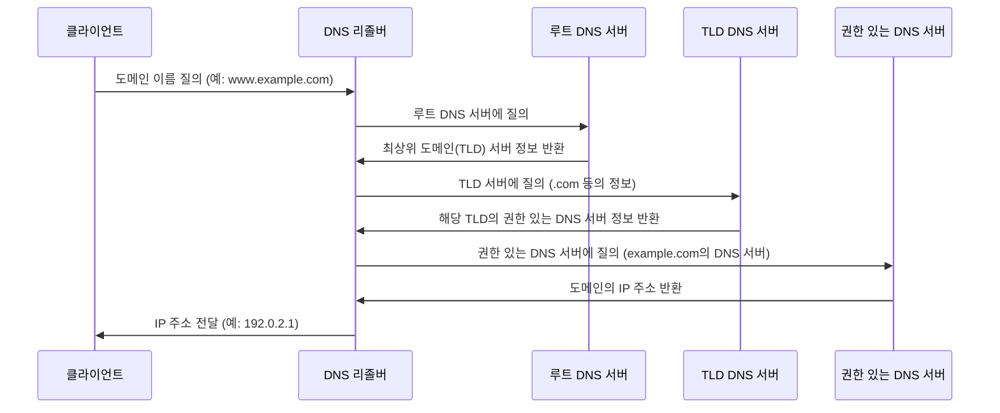

## DNS란
Domain Name System의 약자로 사람들이 쉽게 기억할 수 있도록 문자열(www.naver.com)과 네트워크 상에서 사용하는 각종 정보(ip, txt)등을 변환하는 역할을 수행하는 수직적인 이름체계를 뜻한다.

## DNS의 기본요소
- 도메인 네임 ex) domain.com
- DNS 레코드 ex) A레코드, AAAA레코드, NS, MX 등
- 네임 서버 ex) BIND

## DNS의 특징
1. 분산구조형 데이터 베이스
2. 트리 구조의 도메인 네임 체계
3. 대표적으로는 ip주소이지만 그 이외에 다양한 데이터 설정가능

## 도메인 네임의 구조
```mermaid
graph TD
    A[Root] --> B[최상위 도메인 (TLD)]
    B --> C[차상위 도메인 (Second-level domain)]
    C --> D[서브도메인 (Subdomain)]
    D --> E[호스트 이름 (Hostname)]
```
root : 모든 도메인 시스템의 가장 시초 
최상위 도메인 : 대표적으로는 .com, .net, .biz 등이 있다.
차상위 도메인 : 대표적으로는 .kr, .jp, .cn 과 같은 국가별 도메인이 있다.

## 도메인 이름의 구성
1. 도메인 이름은 레이블의 조합으로 구성된다.
ex) www.domain.com이라면 "www", "domain", "com", ""의 4개의 레이블로 구성되어져있는 것이다.
레이블 전체의 길이는 255byte를 초과할 수 없으며 각 레이블은 63byte를 초과할 수 없다.

2. 하나의 도메인 이름은 인터넷에 unique해야한다.
다만 domain.com과 domain.kr은 같은 도메인이 아니다. 최상위 도메인이 다르기 때문

3. FQDN(Fully Qualified Domain Name) 도메인 이름의 완전한 표현
DNS 질의 응답 시에는 항상 FQDN을 사용한다.
ex) www.domain.com. 은 FQDN이지만 www.domain.com은 그렇지 않다. (끝의 "" 레이블이 없기때문이다.)

## DNS 서버의 종류
1. Authoritive DNS
도메인 존 데이터를 적재하여 응답처리하는 네임서버 (일반적으로 생각하는 도메인 서버)

2. Recursive DNS(또는 Cache DNS)
타 호스트를 대신하여 질의된 DNS 데이터를 조회, 응답하는 네임서버이다.

## DNS 질의과정

** DNS 리졸버 : client와 DNS간의 중개 역할을 하는 소프트 웨어를 뜻함.
1. 클라이언트가 DNS질의를 시작
2. 클라이언트가 DNS 리졸버에게 질의
3. DNS 리졸버는 root DNS 서버에 질의
4. root DNS서버는 최상위 도메인(TLD) 서버의 ip (hint)를 알려줌
5. DNS 리졸버는 TLD DNS서버에 다시 질의
6. TLD DNS서버는 해당 도메인의 Authoritative DNS 서버 정보를 반환함
7. 리졸버는 Authoritative DNS서버에 최종적으로 질의함
8. Authoritative 서버는 질의한 도메인의 ip를 반환
9. DNS 리졸버는 해당 ip주소를 클라이언트에게 전달함


