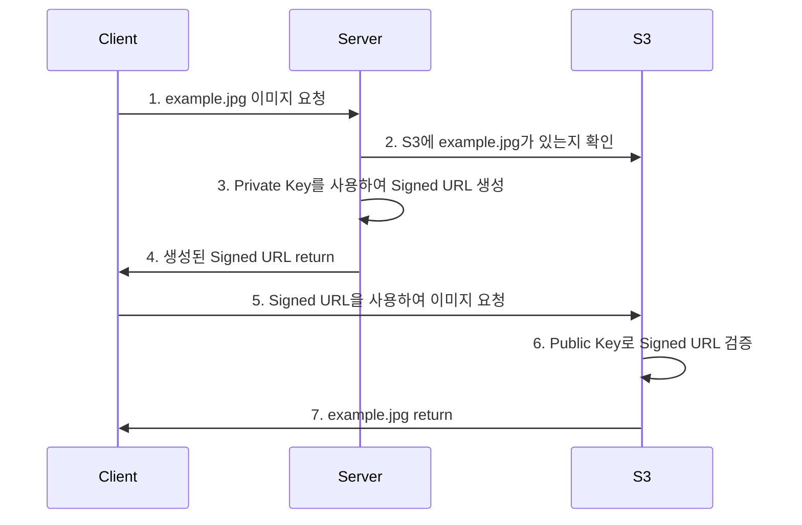
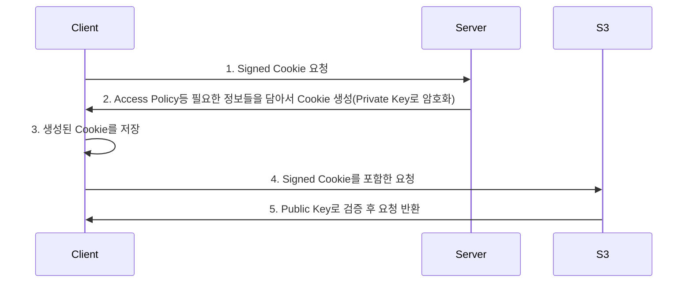

## Signed URLs 와 Signed Cookie 활용하기

**Signed URLs** : 주로 개별 컨텐츠 (이미지, 비디오 등)의 접근 권한을 관리하기 위해 사용한다.  
**Signed Cookie** : 주로 많은 수의 컨텐츠, Premium 회원 컨텐츠처럼 개별이 아닌 묶음을 관리하기 위해 사용한다.

---
&nbsp;

### Signed URLs
Signed URL은 말그대로 서명된 URL이며 특정 리소스의 관리를 위해서 사용된다. 아마도 Cloud sevice(AWS, Google Cloud 등)를 사용해서 개발해본 개발자라면 한번쯤 접해봤을 법하다. 아래는 AWS SDK로 생성한 URL 예시이다. 

```
https://example-bucket-name.s3.amazonaws.com/images/example.jpg?
X-Amz-Algorithm=AWS4-HMAC-SHA256
&X-Amz-Credential=AKIAISDFGSAGAMPLE%2F20240613...
&X-Amz-Date=20240730T121407Z
&X-Amz-Expires=3600
&X-Amz-SignedHeaders=host
&X-Amz-Signature=549b82e38a2e3c401e6f6650516d...
```

#### 필요성
Signed URL은 일정한 시간만큼만 Resource(사진, 이미지, 문서 등등등)를 제공하기 위해 주로 사용된다. 왜 일정시간 만큼만 제공하려고 할까?? 


인스타그램을 예시로 들 수 있을것 같다. 크롤링 봇을 사용해서 인스타그램의 이미지URL을 크롤링 하는 봇을 만들었다고 생각해보자.   
만약 크롤링한 URL에 아무런 제한이 없다면 1년후든 2년후든 해당 resource에 접근 할 수 있다. 이런 상황은 어떤 회사에서도 원하는 것이 아닐것이다.  
꼭 위와 같은 상황이 아니더라도 Resource에 대한 관리는 필요하다. 단순히 URL을 획득한 것이 Client에게 영구적인 접근 권한을 주는 일은 관리의 측면에서도 있을 수 없는 일이다. 

아래는 실제 인스타그램 이미지 URL 이다. AWS의 그것과는 다른 형태이긴 하지만 이것저것 뭔가 붙어있다는건 비슷하다.

```
https://scontent-ssn1-1.cdninstagram.com/v/t51.29350-15/448168962_795683945866134_348106152207001123_n.jpg?stp=dst-jpg_e35_p1080x1080&_nc_ht=scontent-ssn1-1.cdninstagram.com&_nc_cat=106&_nc_ohc=KSde_WOcQhEQ7kNvgGcQWnT&gid=5c4e8a0574a141d59a7972296bbef3f0&edm=AOQ1c0wBAAAA&ccb=7-5&ig_cache_key=MzM4NzM1MDEwNjM3Mzg4MDM3OQ%3D%3D.2-ccb7-5&oh=00_AYAw3b1Na_WiTwdTqRkNRHcGXoss_8g3R_vumNp5Rd_V6Q&oe=669E3319&_nc_sid=8b3546
```

#### 작동방식
비 대칭키(public key, private key) 방식이 사용된다. private key는 Server에서 가지고 있고 public key는 S3에서 가지고 있다. 아래 다이어그램을 보자.



**3. Private Key를 사용하여 Signed URL 생성**  
Signed URL을 생성할 때는 위의 S3 URL 예시와 같이 example.jpg의 식별자, expires, permission과 같은 정보들이 포함되어서 생성되어진다.


### Signed Cookie
Signed Url과 작동하는 방식은 거의 비슷하다. 다만 URL은 주로 하나의 컨텐츠를 관리하기 위해 사용된다면 Cookie는 좀 더 많은 양의 컨텐츠를 한번에 관리할 떄 사용한다. Cookie에는 많은 양의 정보를 담을 수 있기 때문이다. 예를 들어 access policy 같은 것들을 넣어서 생성한다.

아래 다이어 그램을 살펴보자


